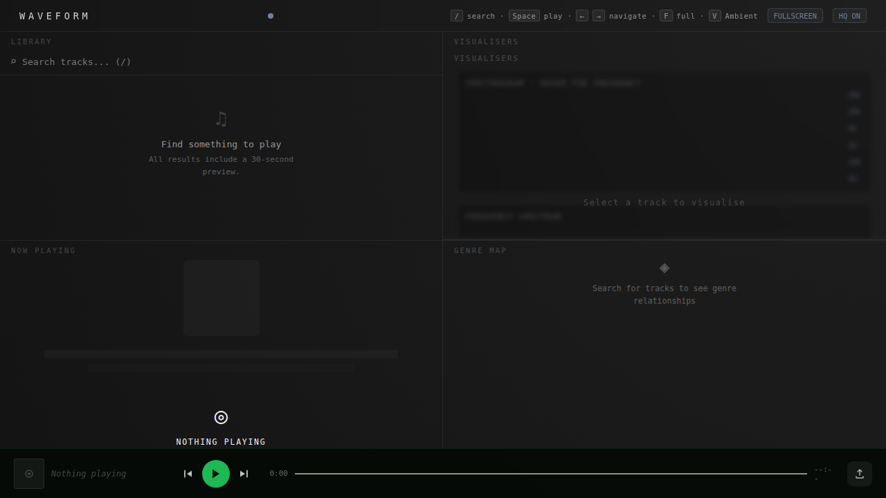
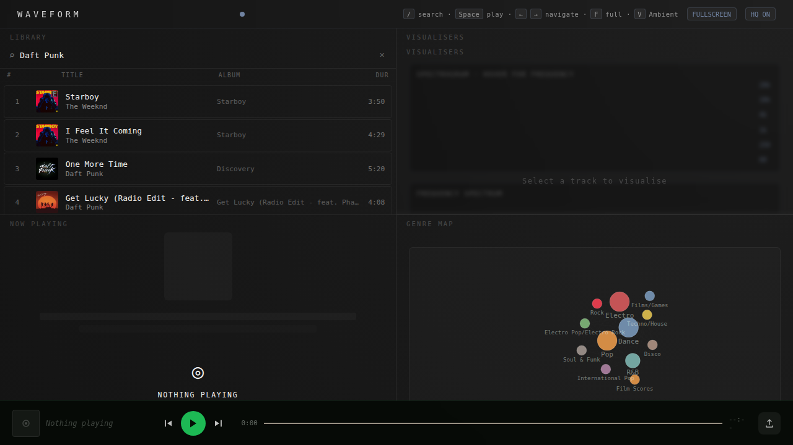
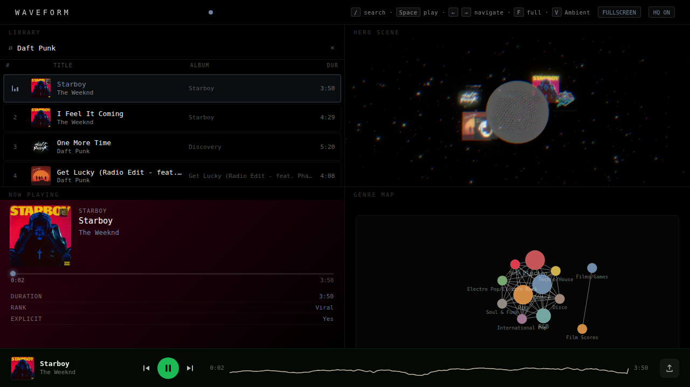
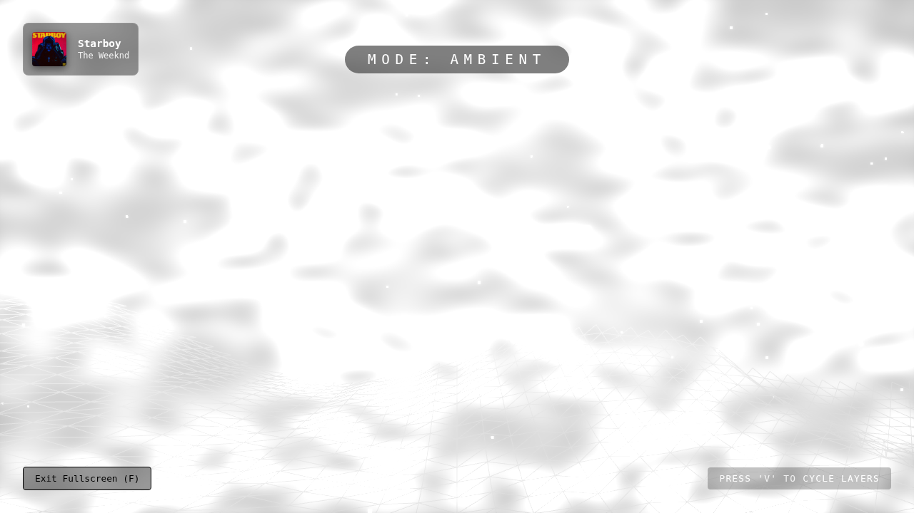
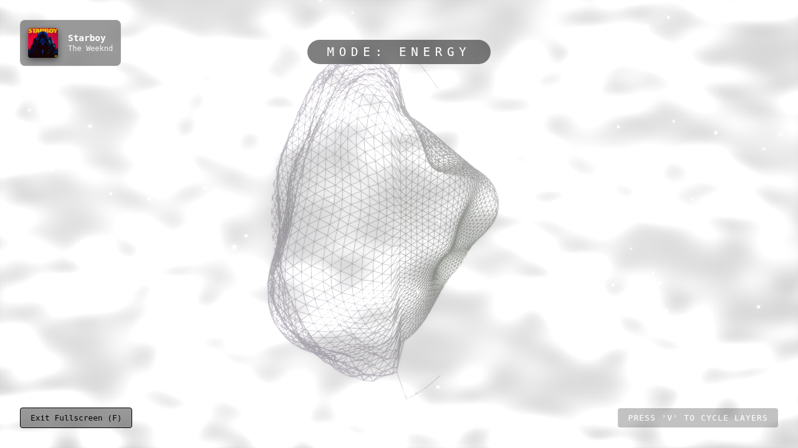

# Waveform

> Where the audio **is** the UI. A high-performance music discovery interface where every visual element reacts to the signal in real-time.



Waveform is a browser-based music player and visualiser built on the Deezer public API. It transforms the act of music discovery into a visceral, multi-sensory experience.

---

## 🖼️ Gallery

| Search & Discovery | Real-time Playback |
| --- | --- |
|  |  |

| Ambient Mode | Energy Mode (GPU Orb) |
| --- | --- |
|  |  |

**[Live Demo](https://waveform-music.vercel.app/)** · **[Technical Brief](#technical-achievements)**

---

## ⚡ Features

### 🎨 The Visual Experience
- **Post-Processing Stack**: A cinematic "Visualizer Master Scene" powered by Three.js `EffectComposer`. Features real-time Bloom (bass-pulsing), Chromatic Aberration, Vignette, Film Grain, and Depth of Field.
- **Dynamic Layering & Blending**: Advanced multi-layer scene composition (Background, Midground, Foreground) with automated 30s cross-fades between visualizers.
- **Enhanced GLSL Orb**: A subdivided icosahedron that "cracks" and emits light rays upon bass peaks, with an inner glowing core for depth.
- **Beat-Driven Particles**: GPU-accelerated particle field that triggers high-velocity "explosions" on beat detections, with density scaling based on performance profiles.
- **Butterchurn (MilkDrop)**: Integration of GPU-accelerated WebGL2 presets with enhanced 5.7s blending and automated preset cycling.
- **Reactive Audio Terrain**: A reflective 3D ocean that morphs with frequency data, featuring real-time light reflections and audio-reactive brightness.
- **Album-Reactive Theming**: The entire UI dynamically samples the current album art to generate a harmonized color palette.

### 🎧 The Audio Engine
- **Hybrid Beat Detection**: Combines Bass Energy Variance with Spectral Flux to identify onsets and estimate BPM in real-time.
- **Waveform Scrubber**: A mini-oscilloscope progress bar that allows seeking while visualising the time-domain signal.
- **Spectrogram & Radial Modes**: High-precision scrolling frequency displays and circular visualisers.

---

## 🛠️ Technical Achievements

### 1. Zero-Allocation 60fps Pipeline
In many React visualisers, passing raw audio data through state causes catastrophic performance degradation. Waveform solves this by:
- Using a **module-level rAF loop** that bypasses the React component lifecycle.
- Implementing **direct buffer mapping**: Raw `Uint8Array` data from the AnalyserNode is passed to canvas callbacks without array allocations, slicing, or spreading.
- Reducing GC pressure to near-zero, ensuring a locked 60fps even with multiple complex visualisers active.

### 2. GPU-Accelerated Audio Processing
Rather than calculating geometry on the CPU, Waveform uses **DataTextures** to pass frequency bins directly into custom GLSL shaders.
- **Vertex Shaders**: Morph 3D geometry (Orb, Terrain) in real-time.
- **Fragment Shaders**: Drive organic color cycling and "glow" effects based on audio power.

### 3. Strict DOM/Render Boundary
To prevent the "D3 vs React" or "Three.js vs React" conflict:
- **D3** owns its internal simulation and DOM mutations inside an SVG container.
- **Three.js** mutations happen inside a `useFrame` loop that pulls state imperatively from Zustand (`getState()`), preventing unnecessary React re-renders.

---

## 🧠 Technical Challenges & Solutions

### Challenge: Spotify's Development "Wall"
Originally designed for Spotify, the project hit a dead-end when Spotify restricted audio playback to Premium accounts in Dev mode.
- **Solution**: Pivoted to the **Deezer API**, which offers public 30-second previews. This allowed the app to remain "zero-auth" and accessible to anyone immediately upon landing.

### Challenge: Cross-Origin Resource Sharing (CORS)
The Deezer API blocks direct browser requests, usually requiring a proxy server.
- **Solution**: Leveraged **Vercel Rewrites** to handle the proxying at the edge. This removed the need for a dedicated backend or serverless functions, keeping the architecture purely frontend.

### Challenge: Beat Detection Accuracy
Simple volume-thresholding beat detection is unreliable for complex tracks.
- **Solution**: Implemented a **Hybrid Detection** algorithm. By combining Energy Variance (good for bass) with Spectral Flux (good for percussive hits), the engine achieves much higher confidence in its "beat" signal, driving more rhythmic visual pulses.

---

## ⌨️ Keyboard Shortcuts

| Key | Action |
| --- | --- |
| `Space` | Play / Pause |
| `←` / `→` | Previous / Next track |
| `F` | Toggle Fullscreen |
| `V` | Cycle Visual Layer |
| `S` | Toggle Visual Settings |
| `R` | Start/Stop Recording |
| `J` / `K` | Navigate Search Results |
| `/` | Focus Search |
| `P` | Cycle Butterchurn Presets |

---

## 🚀 Getting Started

### Prerequisites
- Node.js 18+
- **pnpm** (preferred)

### Installation
```bash
pnpm install
```

### Development
```bash
# Recommended (includes API proxy)
vercel dev

# Plain Vite (no API proxy)
pnpm dev
```

---

## 📦 Stack
- **Framework**: React 18, TypeScript, Vite
- **3D/Vis**: Three.js, React Three Fiber, D3.js, Butterchurn
- **State/Animation**: Zustand, Framer Motion
- **API**: Deezer (via Vercel Rewrites)

---

Developed by [Keagan Herman](https://github.com/Keagan-Herman)
